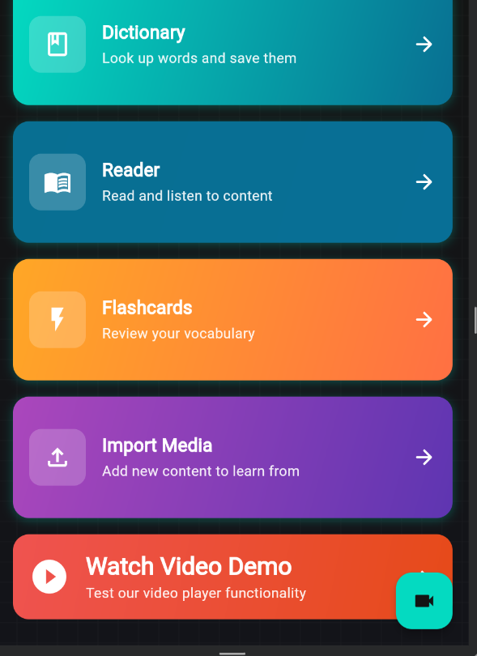

# Faseeh - Language Learning App

Faseeh is a minimal language learning application built with Flutter. It simulates the experience of learning from media content by displaying videos with static captions, preparing the foundation for AI-enhanced features.

## Features (MVP)

- **Simulated Video Player:** Shows a local video with simple playback controls (Play/Pause, Mute, Seek)
- **Static Captions:** Displays a hardcoded caption below the video to simulate subtitle or AI-transcribed content
- **Clean Interface:** Simple UI layout designed for later expansion (e.g., AI integration, media import)


## Screenshots

  

## Technical Details

- **Framework:** Flutter
- **State Management:** Riverpod
- **Navigation:** GoRouter
- **Supported Platforms:** Android, iOS, Web

## Getting Started

1. Clone the repository:
   ```bash
   git clone https://github.com/yourusername/faseeh.git
   ```

2. Install dependencies:
   ```bash
   flutter pub get
   ```

3. Run the app:
   ```bash
   flutter run
   ```

## Project Structure
