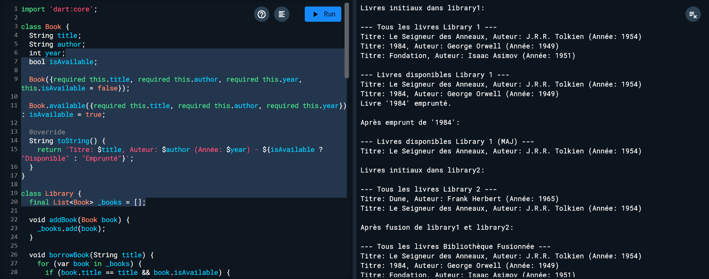
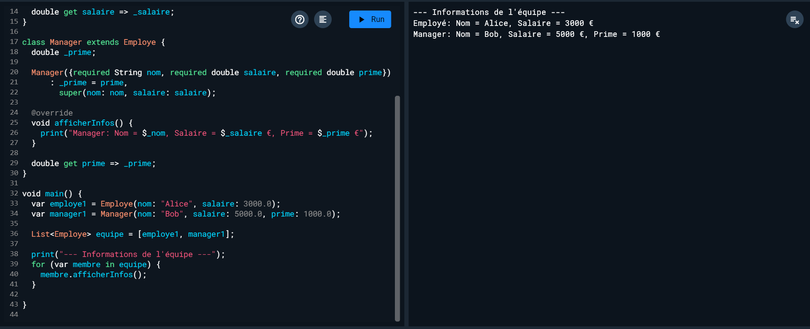
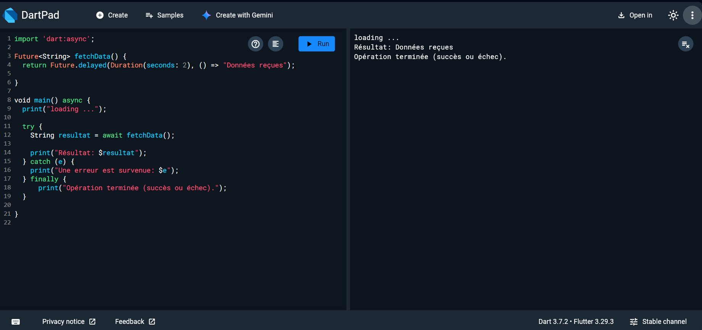

# Dart Exercises

This repository contains three Dart exercises covering different concepts.

## Exercise 1: Library Management

This exercise demonstrates basic Object-Oriented Programming concepts in Dart, including classes (`Book`, `Library`), constructors, methods, and operator overloading. It simulates a simple library system where books can be added, borrowed, and listed.

**Execution:**

## Exercise 2: Employee Hierarchy

This exercise illustrates inheritance and polymorphism in Dart. It defines a base class `Employe` and a derived class `Manager`, showcasing how methods can be overridden and how objects of different classes can be treated uniformly through a common base class.

**Execution:**

## Exercise 3: Asynchronous Data Fetching

This exercise covers asynchronous programming in Dart using `Future` and `async`/`await`. It simulates fetching data after a delay and handles potential errors using `try`/`catch`/`finally`.

**Execution:**

